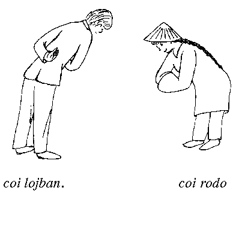

 

## 第1章 : 本書について 「ロジバンの世界へようこそ」

### 1.1 ロジバンとは何か

人工言語であるロジバンは、ログラン (創始者 James Cooke Brown ) が前身であり、このプロジェクトは1955年にスタートした。   
"Loglan" という題名の記事が Scientific American に掲載された。 SF小説 The Moon Is A Harsh Mistress 等で言及される。  
1987年からは、Logical Language Group (LLG=この本の出版元) がロジバンの開発を牽引している。  
エスペラントをはじめ人工言語はたくさんあるが、ログラン／ロジバンには以下のユニークな特長がある。  

- 人間対人間のコミュニケーション、人間対コンピュータのコミュニケーションの補助
- 文化的に中立
- 述語理論がベース
- 曖昧さがない、それでいて柔軟な文法 - スペルと音が一致し、音から単語が一意的に決まる
- 単純で、覚えるのが楽
- 1300の根語を組み合わせて語彙を作れる
- 規則的で例外がない
- 思考に対する制限を取り除く
- 創作・科学、理論的・実践的な応用ができる
- 翻訳・詩・散文

### 1.2 本書の内容

この本は、言語の文法をなるべくカバーする「参照文法」である。  
ロジバンは多くの特徴を持つ言語で、特徴の持つ機能を「発見」する努力がなされていた。  
ロジバンは特定の個人やグループによって発明されたものではない。 文法機能が導入され、後になってその用法が理解されることがよくある。   
この本は説明ではなく記述である。   

21章に構文解析用の形式文法を掲載した。   
2章で文法の概要を、21章で形式的な文法構造をしめし、その間の章は形式に対して意味論的な肉付けをする。 

この本の出版は、言語の完成を意味する。   
ロジバンは、作者によって故意的に改変されることはもう無い。   
ロジバンの進化は、実用に耐える語彙を作り出すことと、自然な（語彙の）偏移によってのみ起こる。 

他の言語とは違い、いわゆる「言語専門家」による「改造」の心配無く学べる。 この本は、段階的に作られている。各章では一つのトピックについて説明して、 その後全体が大きな構造にまとまっていく。  
相互参照はあまり無いが、索引を充実させた。 各章のタイトルは、言葉遊びになっているものがある。   
１章は English As We Speak It in Ireland (P. W. Joyce) のもじりであり、 "Lojbanistan" とは Lojban を母語として話す人々の仮想的な国である。  

### 1.3 本書の表記方法

各章には節があり，その中には解説文、例文、表などがある。 本書が独学用と参考用として使えるように特徴的な表記を取っている。
```
1.1) mi klama le zarci
    (私 ～へ行く 私が～と呼ぶ店)
    (私は店へ行く) 
```
語彙の要因で新しい文法要素が分かりにくくならないように、なるべく簡単で馴染みやすい例を意図的に使っている。  
「教科書」的ではないが、本書は教科書ではなく、独習および参照に使えるものを意図している。   
  
例文は３行から構成される。  
1行目はロジバン文で、２文以上の同一の意味のものも含む。2行目は逐語訳・直訳、3行目は通常の訳である。  
`# 逐語訳を割愛するので、この部分を変える必要あり`  
角括弧で囲まれた語は、省略可であること意味している（IPAを表す時にも使う）。  
表の構成は、ロジバンの単語、文法カテゴリ（大文字で表記）、語義・意味の ３列からなる。  
専門用語として用いられている「ロジバン用語」は、第２章の末尾のリストにて解説されている。  

### 1.4 免責事項

本書で使用している例は実際の人物・場所・組織とは関係なく、類似性は偶然 であり意図したものではない。   
gismu, lujvo の定義や配列構造は、英ロジ辞書（本書執筆時点で未出版）のも を優先する。  
[# オンライン辞書](https://jbovlaste.lojban.org/)

### 1.5 謝辞

本書のメイン著者は John Cowan （「私」）であるが、他の人が書い て私が修正したものがある。  
第２章は Athelstan, Nora Tansky LeChevalier, Bob LeChevalier によって書かれた個別の文章を融合したものである。  
他には、Bob LeChevalier, Nora Tansky LeChevalier 、 Chuck Barton, Clark Nelson, Jeff Taylor などが貢献している。   
Ivan Derzhanski の自然言語研究の結果を第5章では使っている。  
本書の絵は Nora Tansky LeChevalier によるものである。   
Loglan の創始者である James Cooke Brown および貢献者の Doug Landauer, Jeff Prothero, Scott Layson, Jeff Taylor, and Bob McIvor に感謝する。

### 1.6 参考文献

Loglan の設立時の文書 Loglan 1: A Logical Language (James Cooke Brown, 4th ed. 1989, The Loglan Institute, Gainesville, Florida, U.S.A.) がベースである。  
ただし、当の本人は本書の内容および Lojban の存在そのものを否定している。 ロジバンの論理は、Word and Object (W. v.O. Quine, 1960, M.I.T. Press) によるところが大きい。  
特に観察文についてはロジバンの逐語訳によく似ている。 15章の否定の論理は A Natural History of Negation (Laurence Horn, 1989, University of Chicago Press) から来ている。   
読者が本書を読むころには、教科書、ロジ英辞書、ロジバン概説の本が利用できるようになっているかもしれない。

### 1.7 絵のキャプション

**（省略）**

### 1.8 ライセンス表示

Copyright © 1997 by The Logical Language Group, Inc. 本書の複製・再配布は、この著作権およびライセンスを表示する限り認められる。 本書を改変し配布することは、この著作権およびライセンスを表示、変更点を 明示し、全体を同じライセンスの元で配布する限り認められる。 本書の翻訳の配布についても上記の改変と同じ条件であるが、本ライセンスを LLG によって認められた翻訳によって表示しても良い点が異なる。 第21章の内容はパブリック・ドメインである。
