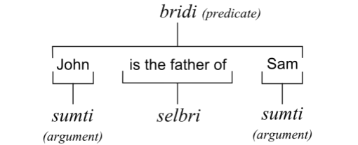

## 第2章 : ロジバン文法概説

### 2.1 ブリディの（bridi）の概念

この章では例文を用いて、基本的なロジバン文の構造を示す。  
概説であり、細部については後の章で扱う。  
ジョンとサムに関する次の3つの例を見てみよう。  

**例 2.1**  
ジョンはサムの父親だ。    
**例 2.2**  
ジョンはサムを殴る。  
**例 2.3**  
ジョンはサムよりも背が高い。

例はすべてジョンとサムの関係について記述したものである。  
例 2.1 のような 静的な関係 を記述するときには、名詞 "父親" を用いる。  
例 2.2 のような 動的な関係 を記述するときには、動詞 "殴る" を用いる。  
例 2.3 のような 連体（限定）的な関係 を記述する時には、 形容詞 "高い" を用いる。  
ロジバンでは、3つの例が構造的に同等であり、文法で区別されない。同じ品詞でこのような関係を表す。  
断言 "_predication_" のことを ブリディ "**_bridi_**" と呼ぶ。  
中心的な品詞（`＃上の例では、名詞、動詞、形容詞に相当`）をセルブリ "**_selbri_**" と呼ぶ。  
項 "_argument_" に当たるものは、スムティ "**_sumti_**" と呼ぶ。  

:::note \# 訳者補注

|スムティ|セルブリ|スムティ|  
|:------:|:------:|:------:|  
|ジョンは|父親だ|サムの|  
|ジョンは|殴る|サムを|  
|ジョンは|背が高い|サムよりも|  
 
:::  

たとえば、"与える" は、3つの要素で構成される。  
"授与者"、"収受者"、そして "贈与物" である。  
3つの要素はスムティ、"与える" はセルブリにあたる。  

**例 2.4**  
ジョンは本をサムに与える。  
**例 2.5**  
サムは本をジョンに与える。  
  
例 2.4 例 2.5 は "ジョン" と "サム" の相対的な位置が入れ替わっているため、文の意味は異なる。  

**例 2.6**  
本はサムをジョンに与える。
  
例 2.6 は変な文法に思われるが、"与える" という単語で表現される文の関係性は、例 2.4  例 2.5 と同じである。  

:::note \# 訳者補注

|スムティ|セルブリ|スムティ|スムティ|
|:------:|:------:|:------:|:------:|
|ジョンは|与える|本を|サムに|
|サムは|与える|本を|ジョンに|
|本は|与える|サムを|ジョンに|
|"者は" の場所||"物を" の場所|"者は" の場所|
 
:::

ロジバンでは、あらゆるセルブリは指定された数の項（スムティ）を持つ。  
それらをまとめて、場所構造（place stracture以下、PSと略す）と呼ぶ。  
最も単純なセルブリは、 ギスム "_gismu_" と呼ばれる根語 "_root word_" で構成され、PSが辞書で明示的に示される。  
文の作成時は、PSのスムティを埋めるため、何を使うか決めることが主な作業となる。  

### 2.2 発音
  
発音とつづりは3章で解説される。ここでは概略を示す。  
  
ロジバンは以下の6つの母音がある。  
`a`, `e`, `i`, `o`, `u` and `y`  
  
最初の5つは、だいたい以下の単語の母音に相当する。  
`father` の `a` , `let` の `e` , `machine` の `i`, `dome` の `o`, `flute` の `u`
  
`y` は、あいまい母音 である。  
`about` や `around` の `a` に相当する。  
  
ロジバンには、12の子音がある。英語の以下の子音に相当する。  
`b`, `d`, `f`, `k`, `l`, `m`, `n`, `p`, `r`, `t`, `v` and `z`
  
`c` は、`hush` の `sh` のように発音される。   
`j` は、`pleasure` の `s` のように発音される。  
`g` は、つねに `gift` の `g` のように発音される。  
`s` は、つねに `sell` の `s` のように発音される。  
`x` は、英語にはない発音であり、スコットランド語の`loch` の `ch` や、  
スペイン語の `junta` の `j` や、ドイツ語の `Bach` の `ch` のように発音される。  
`r` は、巻き舌にしてもしなくてもよい。  
  
ロジバンの二重母音 `ai`, `ei`, `oi` と `au` は、英語の以下のものと同様である。  
`sigh`, `say`, `boy`, and `how`.  
  
`i` で始まる二重母音は、英語の `y` のように発音される。 （`io` は `yo` のように）  
  
`u` は、 英語の `w` のように発音される。 （`ua` は `wa` のように）

ロジバンは、 ピリオド `.`、 コンマ `,`、 アポストロフィ `’` を 準文字 として扱う。   
   
ピリオドは、声門閉鎖音、あるいは休止を表わす。  
  
アポストロフィは、英語の `h` のような発音を意味する。  
他の子音と違って、単語の最初と最後に使われないうえ、他の子音と連続しない。母音の間でのみ使われる。  
  
コンマは通常、つながって発音される音節を区切る時に使われる。  
  
アクセントは、すべての単語の最後から2番目の音節にある。  
ただし、`y` は あいまい母音 でアクセントは置かれないので、2番目にあるときは、3番目の音節にアクセントが置かれる。  
単音節の単語にはアクセントは置かれない。  
  
すべての単語はつづられるように発音される。発音されない文字はない。  
  
### 2.3 スムティとして使われる語  

以下は単体でスムティとして使われる語の表である。  
  
|語|意味|
|:-:|:-|
|mi|私・私たち|  
|do|あなた・あなたたち|  
|ti|これ・これら|  
|ta|それ・それら（あれ・あれら）|  
|tu|あれ・あれら|  
|zo'e|不特定項（スムティが重要でなかったり、不特定の場合に使う)|  
  
ロジバンのスムティは、 数（単数/複数）、 性（男性/女性）について特定しない。  
区別はオプションとして加えることもできる。  
  
`ti`、`ta` および `tu` は、話し手が指し示すものに対して使われる。  
原則として、指し示すことのできないものには使われない。
  
名前はスムティとして使われるが、`la` を前に付与する。

|文|意味|
|:-:|:-:|
|la meris.|メリーという名前のもの|
|la djan.|ジャンという名前のもの|

ロジバンの名前には、つづり方や使える文字に制約がある。  
  
### 2.4 セルブリとして使われる語

以下はこの章でセルブリとして使われる語である。  
  
|語|意味|
|:-:|:-|
|vecnu|x1（売る者）は x2（品）を x3（買う者）にx4（価格）で売る|
|tavla|x1（話者）は x2（聞く者）に x3（題目）について x4（言語）で話す／語る|
|sutra|x1（行為者は x2（動作）に関して速い／すばやい|
|blari'o|x1（対象・色）は青緑色|
|melbi|x1（対象・概念は x2（審美者）にとって x3（審美基準）において美しい／綺麗だ|
|cutci|x1 は x2（足）のための x3（素材）の靴／ブーツ|
|bajra|x1 は x2（表面）を x3（肢）を用いて x4（調子）で走る|
|klama|x1 は x2（終点）に x3（起点）から x4（経路）を x5（方法）で行く／来る|
|pluka|x1 は x2（経験者）にとって x3（条件）のもと快い／心地良い|
|gerku|x1 は x2（種類）のイヌ|
|kurji|x1 は x2 を世話する／面倒みる|
|kanro|x1 は x2（基準）において健康／すこやか|
|stali|x1 は x2 に留まる|
|zarci|x1 は x2（製品）を商う x3（営者）の店／市場|
  
セルブリは、各スムティが場所に応じてどのような役割を持つか規定する。  
上の表は、スムティの場所を x1, x2, x3, x4, x5 として示している。  
ロジバンでは、話者や書き手が必要だと思う場合は（特定の方法によって）、新しく語を作ることができる。  
  
### 2.5 簡単なブリディの例

簡単なブリディ。ギスム `tavla` の場所構造（PS）は以下の通り。  
  
**例 2.7**  
x1 は x2 に x3 について x4（言語）で話す／語る  
  
xの後の数字は、ギスムの持つ諸項（場所）を表わしている。  
  
**例 2.8**  
ジョンは サムに ロジバンで 工学について 話す。  
  
"ジョンは" は x1 の場所に, "サムに" は  x2 の場所、 "工学について" は x3 の場所、そして "ロジバンで" は x4 の場所に該当する。  
つまり、次のように言い換える事ができる。   
  
**例 2.9**  
話し手はジョン、聞き手はサム、工学について、ロジバンで話されている。  
  
例 2.7 に対応するブリディの形式は次のようになる。  
   
**例 2.10**  
x1 [cu] tavla x2 x3 x4  
  
単語 `cu` は、前のスムティと後ろのセルブリを分ける働きをする。  
次の例のように、しばしば省略される。  

**例 2.11**  
mi tavla do zo'e zo'e  
私はあなたにあることについてある言語で話す。  
  
**例 2.12**  
do tavla mi ta zo'e   
あなたは私にそのことについてある言語で話す。  
  
**例 2.13**  
mi tavla zo'e tu ti  
私はある人にあのことについてこの言語で話す。  
  
シマヴォ`zo'e`は省略することもできる。  
例 2.11 と 例 2.12 は以下のように表わすことができる。  
  
**例 2.14**  
mi tavla do  
私はあなたに話す。（あることについてある言語で）

**例 2.15**  
do tavla mi ta  
あなたは私にあのことについて話す。（ある言語で）  
  
例 2.13 のように`zo'e`がブリディの最後にない場合は省略できない。  

### 2.6 いろいろなブリディ
  
例文を見てみよう。  
  
**例 2.16**  
mi [cu] vecnu ti ta zo'e  
:::note
|mi|[cu]  vecnu|ti|ta|zo'e|  
|:--:|:--:|:--:|:--:|:--:|  
|売り手 x1|売る|売る物 x2|買い手 x3|価格 x4|  
|私は|売る|これを|その人に|ある価格で|  
I sell this-thing/these-things to that-buyer/those-buyers.  
私はこれ（ら）をその買い手（ら）に売る。 （価格は重要でない）
:::

例 2.16 では、セルブリの前にスムティ(x1)はひとつしかない。  
セルブリの前に複数のスムティを置くこともできる。その場合には、スムティの並びを替えてはいけない。  
  
**例 2.17**  
mi ti [cu] vecnu ta  
:::note
|mi|ti|[cu] vecnu|ta|
|:--:|:--:|:--:|:--:|
|売り手 x1|売る物 x2|売る|買い手 x3|
|私は|これを|売る|あの人に|
I this thing do sell to that buyer.
:::

**例 2.18**  
mi ti ta [cu] vecnu  
:::note
|mi|ti|ta|[cu] vecnu|
|:--:|:--:|:--:|:--:|
|売り手 x1|売る物 x2|売り手 x3|売る|
|私は|これを|あの人に|売る|
I this thing to that buyer do sell.  
**\# これはまさに日本語と同じ順序である**
:::
  
例 2.16 から 例 2.18 は同一の意味である。  
通例、セルブリの前にひとつ以上のスムティが出るのはひとつのスタイルか、あるいは強調のためである。  
（英語以外の言語の話者はそのような順番を好むかもしれない）  
セルブリの前にスムティがない場合は、x1の値が `zo'e`であると考えることができる。  
それが重要でないとか、言う必要がないほど明白な場合など。セルブリの後のスムティはかならずx2から始めなくてはならない。  
  
**例 2.19**  
ta [cu] melbi
:::note
|ta|[cu] melbi|  
|:--:|:--:|  
|対象・思考 x1|美しい（誰かにとって、ある基準で|  
|それ（それら）|美しい|  
|それは美しい。|それらは美しい。|  
:::
  
x1が省略された場合は以下のようになる。  
    
**例 2.20**  
________ [cu] melbi  
:::note
|________|[cu] melbi|  
|:--:|:--:|
|不特定のx1|美しい（誰かにとって、ある基準で）|
||美しい！ それは美しい！|
:::
  
x1を省略するのはセルブリを強調するためで、 観察文 "_observative_"という。  
この種の文は、観察した記録や関係を他人にすばやく伝えたいときに使用される。  
一般的に理解されている観察文として、煙を見たり、においを嗅いだりした時の「煙だ！」や、  
通りを横断している人が危険に晒されている時の「車だ！」が含まれる。  
セルブリの前にスムティがない場合は、全てのセルブリを観察文として使うことができる。  
`cu`は観察文には必要ないし、使ってはいけない。`cu`はセパレーターであり、セルブリの前にスムティが必要である。  
`cu`を使う際にセルブリとスムティは分離される必要がある。セルブリの前にスムティがなければ、`cu`は許可されない。  
`cu` のように、文法的役割を持つ短い語を シマヴォ "_cmavo_"と言う。  
  
### 2.7 スムティの順序の変更

スムティの順序を変更して、あるスムティをブリディの前に出したい時、  
セルブリの前にシマヴォ `se`を置くと、１番目と２番目のスムティを入れ替えることができる。  
  
**例 2.21**  
mi tavla do ti  
私はあなたにこのことについて話す。  
  
**例 2.22**  
do se tavla mi ti  
あなたは私によってこのことについて話される。
  
シマヴォ`te`は、同様に１番目と３番目のスムティの意味を入れ替える。  
  
**例 2.23**  
mi tavla do ti  
私はあなたにこれについて話す。  
  
**例 2.24**  
ti te tavla do mi    
これはあなたに私によって話される。
:::note  
１番目と３番目のスムティは入れ替わっているが、２番目はそのままであることに注意。  
:::
  
シマヴォ`ve` と`xe`は、それぞれ１番目と４番目、１番目と５番目のスムティの意味を入れ替える。  
このような順序の変換は 転換 "_conversion_" と呼ばれ、`se`、`te`、`ve`、および `xe` はセルブリを転換する。  
転換は同時に複数使用することができる。その場合は、左から右への順番で当てはめていく。  
実際は、一度に１つしか使われない。というのは、スムティの場所の操作に関してはもっと便利な方法があるからだ。５章で詳説する。  
これは、英語では 受動態 "_passive voice_" に相当する。転換されたセルブリは新しいPSを持つ。  
転換されたセルブリは、後述の "描写スムティ" で見るように `le selbri [ku]` の形でも使われる。  

### 2.8 長い文章の基本的構造
  
文章は、シマヴォの`ni'o` か `.i`によって区分される。  
それらは、英語における短い休止か、ピリオド、疑問符、感嘆符などのような区切り記号に相当する。  
それらは、次の文のスムティが前の文のスムティとつなげて解釈されないようにする。
  
`ni'o` は、段落を区切る働きをする。  
長い文章においては、 `ni'oni'oni'o`は、章を示し、 `ni'oni'o` は、節を示し、`ni'o`は段落を示す。  
  
`.i`は、文書を区切る働きをする。しばしば別の単語と結合して、文脈における文章の正確な意味を示す。  
後述の` xu `がある場合には文章は疑問文となる。複数の話者が話す場合に、新しい話者が同じ話題を続ける場合でも通例、`.i`を省略する。  
新しい話者は発話を`.i`から始めてもかまわないし、その方が文意は明確になる。
  
### 2.9 タンル

二つのギスムがつながっている場合、最初のものが次のものを修飾し、セルブリは、一番右にある語のPSをとる。  
このような結合されたギスムを タンル "_tanru_" と呼んでいる。例えば、 
  
**例 2.25**  
sutra tavla  
  
このタンルのPSは以下のようになる。
  
**例 2.26**  
x1（者）はx2（者）にx3（題目）についてx4（言語）で速く話す／語る人である  
x1（者）はx2（者）にx3（題目）についてx4（言語）で速く話す／語る

3つ以上のギスムがある場合は、最初のものが2番目を修飾し、その複合した意味が3番目を修飾する。  
さらに、それらが複合した意味が4番目を修飾する。以下同様。  
  
**例 2.27**  
sutra tavla cutci  
  
このタンルのPSは以下のようになる。
  
**例 2.28**  
x1 は x2 が履いている素材 x3 の速く話すタイプの靴  
  
これは 話し手の、速い靴 ではなく、 速く話す人のタイプの靴 という意味である。  
:::note
2つ以上のギスムを接続するために「タイプの～」と訳していることに注意。  
このように訳すことで、学習者がタンルの文脈を理解するのに役に立つ。  
ただし、より創造的な訳も可能である。  
:::
  
**例 2.29**  
bajra cutci  
ランナーの靴  
  
たいていの人は、これを ランナーに適した靴 と解釈するだろうが、（自分自身で）走る靴 と解釈することも可能ではある。  
ただし、一般的にタンルの意味は、含意や比喩ではなく、文脈によって決定される。
  
**例 2.30**  
sutra tavla  
速く話す（人）  
  
このタンルは英語のイデオムのような 口のうまい人・詐欺師 というような含意はない。
  
**例 2.31**  
jikca toldi   
社交的な蝶  
  
これも蝶の意味で、英語のイデオムの 社交好きな人 の含意はない。  
タンルのPSは、つねにそのタンルの最後の構成要素のものとなる。  
従って、次の例では`klama`のPSとなる。  
  
**例 2.32**  
mi [cu] sutra klama la meris.  
私はメアリのところへ急いで行く。  
    
次の例では、転換された`se klama`がタンルの最終部分であり、そのPSは、x1 "目的地"、x2 "行く人" である。
  
**例 2.33**  
mi [cu] sutra se klama la meris.  
私はメアリによって急いで行かれる。（メアリは急いで私のところへ来る）  
  
以下の例は、単なる入れ替えよりも転換の方が多いことを示している。  
  
**例 2.34**  
la tam. [cu] melbi tavla la meris.   
トムはメアリに美しく話す。  
トムはメアリへの美しい話し手である。  
  
例 2.34 は、`tavla` のPSであるが, ２種類の解釈が可能である。  
転換されたのが次の例。  
  
**例 2.35**  
la meris. [cu] melbi se tavla la tam.   
メアリはトムによって美しく話される。  
メアリはトムの美しい聞き手だ。  
  
メアリの役割に焦点を当てると、修飾関係が変わり、2種類の違った解釈が可能となる。   
:::note
転換を使ったときでもPSは変更されないため、文の大幅な変化が見られない。
:::
  
**例 2.36**  
la tam. [cu] tavla melbi  la meris.   
トムはメアリにとって話し手として美しい。  
   
**例 2.37**  
la tam. [cu] se tavla melbi la meris.   
トムはメアリにとって聞き手として美しい。  
  
トムがメアリにとって美しいと見なされる方法は変化するが、2例ともトムは美しさの対象であり、メアリは観察者である。  
  
### 2.10 描写スムティ
  
大抵は、話し手と聞き手同士で指摘できる、それ以外のことについて話をすると思われる。  
もしも、私以外の話者について会話をしたいとする。私の話したいことは当然、`tavla` の最初の位置に当てはまる。  
ロジバンには、セルブリから最初の場所を引き出し、描写スムティ "_description sumti_"と呼ばれるスムティに変換する操作がある。  
描写スムティの `le tavla ku` は、話し手という意味になり、どんなスムティを使用する場合も使用することができる。  
  
例えば、  
  
**例 2.38**  
mi tavla do le tavla ku  
  
は、以下の意味になる。

**例 2.39**  
私はあなたに話し手について話す。  

ここでいう、"話し手" はおそらく自分以外の誰かだが、必ずしもそうとは限らない。  
同様に、`le sutra tavla ku` は、"速い話し手" であり、`le sutra te tavla ku`は、  
"話される速い話題" もしくは、"速く話される話題" である。どちらの意味になるかは文脈による。  
文脈の中で最も説得力のある解釈は、聞き手によって意図されたものであると想定される。  
多くの場合、 `ku` は省略される。とりわけ、文末では必要ないので、次のようにする。  

**例 2.40**  
mi tavla do le tavla  
私はあならに話し手について話す。  
  
例 2.40 は、例 2.38 と同じである。  
    
"速い者が話している" と言いたいときに、`le sutra tavla` と言うと、問題が発生する。  
`le sutra tavla` は、"早い話し手" という意味になり、セルブリが全くない。  
この問題を解決するために、セルブリの前に、これまでオプションであった `cu` という単語を使うことができる。  
`cu` という単語は意味を持たず、ブリディ内のセルブリの始まる位置を示し、前のスムティを分離するためのみ存在する。  
`cu` は、`se` や `te` のような他のシマヴォを含む、セルブリの他の部分の前に来る。  
従って、  
  
**例 2.41**  
le sutra tavla  
速い話し手  
  
**例 2.42**  
le sutra cu tavla  
速い者は話す。  

**例 2.43**  
le sutra se tavla  
速い話され手（聞き手）  
  
**例 2.44**  
le sutra cu se tavla  
速い者は話されている（聞いている）  
  
次のより複雑な例を見てみよう。2つの描写スムティがある。  

**例 2.45**  
mi [cu] tavla le vecnu [ku] le blari'o [ku]      
私は売り手に青緑色のものについて話す。
  
スムティの `le vecnu` は、x1 の場所に "売り手" である `vecnu` が含まれており、  
話し手が念頭に置いている、特定の "売り手" を説明するために使用する。  
同様に、話し手は特定の青緑色のものも念頭に置いている。  
これは、最初のスムティである青緑色のセルブリ、`brari'o` を `le` を用いて説明しているからである。  
例 2.45 では、両方の `ku` を省略することができる。また、`cu` も同様に省略することができる。  
  
### 2.11 ブリヴラの例
  
セルブリの最も単純な形式は、個々の単語である。
それ自身でセルブリの関係を表わす語を ブリヴラ "**_brivla_**" と言う。  
ブリヴラには、ギスム "**_gismu_**"(根語)と、 ルジヴォ "**_lujvo_**"(複合語)と、フヒヴラ "**_fu'ivla_**"(他の言語からの借用語）の3種類がある。  
全て同じ文法的用途がある。これまでのところ、学んできたセルブリのほとんどは、ギスム、またはギスムから構築されたタンルである。  

**ギスム :**  
**例 2.46**  
mi [cu] klama ti zo'e zo'e ta  
私は（あるところから、あるルートで、ある手段で）ここへ来る。  

**ルジヴォ :**  
**例 2.47**  
ta [cu] blari'o  
これは青緑色だ。  

**フヒヴラ :**  
**例 2.48**  
ti [cu] djarspageti  
これはスパゲティである。  
  
一部のシマヴォはセルブリとしても機能し、別のセルブリを表す変数として働く場合がある。  
最も一般的に使用されるものに `go'i` がある。これは、前文の主要なブリディを表し、  
以前に表現されたものの代わりに新しいスムティまたは他の特徴を表現する。  
  
従って、以下の文脈では、
`\# 例 2.48 の文脈`
  
**例 2.49**  
ta [cu] go'i  
それも同様（スパゲッティ）である。  
  
### 2.12  スムティ di'u と la'e di'u
  
私が "その犬は美しい" と言ったときに、あなたは "これは私を嬉ばせる" と応えるかもしれない。  
"これ" が何を指しているのかをどうやって知ることができるだろうか？  
ロジバンでは言葉の意味を伝えるために様々な表現を使用している。
  
**例 2.50**  
le gerku [ku] cu melbi  
その犬は美しい。  
  
ロジバンでは、次の3つの文が "これは私を喜ばせる" の訳になりうる。  

**例 2.51**  
ti [cu] pluka mi  
これ（その犬）は私を喜ばせる。  
  
**例 2.52**  
di'u [cu] pluka mi  
これ（その文章）は私を喜ばせる。  
（その文章が文法的であるとか、その音の響きがいいので）  
   
**例 2.53**  
la'e di'u [cu] pluka mi  
これ（最後の文章の意味 : 犬が美しい）は私を喜ばせる。  
（つまり、その犬が美しいという内容が私を喜ばせる。）  
   
例 2.53 は、1つのスムティを使用して、別のスムティを指摘または参照している。  
`la'edi'u` は1つの語として書くのが一般的である。それは、`di'u` 単体よりも頻繁に使用される。
   
### 2.13  所有

所有 "_Possession_" とは、あるモノが誰のものであるか（または一緒か）ということを特定する概念である。  
所有についての完全な説明は8章にある。所有を表現する簡単な方法は、あるモノの所有者を表すスムティを、  
そのモノを指す描写スムティの中、つまり、`le` とセルブリの間に置くことである。  

**例 2.54**  
le mi gerku cu sutra  
私の犬は速い。  
  
ロジバンでは、所有はかならずしも所有権を意味しない。  
椅子が他人のものであっても、座っているだけで "所有" することができる。  
英語でも所有は同じように気軽に使われるが、実際の所有権や、より密接な関係を指す場合に使われている。  
"私の腕" は、"私が所有している腕" という意味ではなく、"私の体の一部である腕" という意味である。  
ロジバンでは、このような異なる種類の所有を正確かつ簡単に指定する方法を備えている。    
   
### 2.14  呼びかけと命令

`doi` の後に相手の名前をつけることで、呼びかけることができる。  

**例 2.55**  
doi djan.  
  
この文の意味は "やぁ、ジョン、話があるんだ" という意味である。  
また、対象を設定する効果もある。会話の中で何かが変わるまでは、対象は "ジョン" である。  
:::note
例 2.55 はブリディではない。しかし、正当なロジバン文であり、呼びかけ "_vocative phrase_" と呼ばれるものである。
:::
呼びかけでは `doi` の代わりに他のシマヴォを使うことができ、それぞれの意味は異なる。  
例えば、`coi` は、"こんにちは" であり、`co'o`は、"さようなら" という意味である。  
どちらの語も単独で使われることもあれば、何かの語に続く場合もあるし、どちらかの後に休止と名前が続く場合もある。  
（`doi` を使った呼びかけでは名前の前に休止は必要ない。）

**例 2.56**  
coi. djan.  
やあ、ジョン。 

**例 2.57**  
co'o. djan.  
さようなら、ジョン。  

命令文は、ロジバンでは主要なブリディ構造を単純に変化したもので表現される。

**例 2.58**  
do tavla  
あなたは話している。  
  
例 2.58 は単に事実を述べているだけに過ぎない。  
ロジバンでは `do` を `ko` に置き換えるだけで命令文になる。  

**例 2.59**   
ko tavla  

例 2.58 を実現するために必要なことをするように聞き手に指示している。  
これで、"話せ!" の意味になる。他の例では、   
   
**例 2.60**  
ko sutra  
急げ。  
  
`ko` は、かならずしも x1 の場所である必要はなく、スムティが許可される場所であれば、  
どこにでも置くことが可能である。よって、英語の命令文とは非常に異なる可能性がある。  
  
**例 2.61**  
mi tavla ko  
私に話させてください。  
  
シマヴォの `ko` はスムティの適切な位置に置くことができ、セルブリに適している数で使用することができる。  
  
**例 2.62**  
ko kurji ko  
  
例 2.62 と、

**例 2.63**  
ko ko kurji
  
どちらも、"あなたがあなたの面倒を見る"、"あなたはあなたに面倒を見られる" という意味で、  
口語的に言えば、"自分を大切にしなさい" という意味である。  

### 2.15  疑問
   
ロジバンの疑問には多くの種類がある。詳しい説明は19章5節をはじめ、各章に記載されている。  
この章では、"スムティ疑問"、"セルブリ疑問"、"肯定/否定疑問" の3種類を紹介する。  

シマヴォの `ma` は、スムティ疑問を作るために使われる。  
これは、話し手がブリディを真にするために `ma` の位置に置かれるべきスムティを知りたいということを示すものである。  
大抵の場合、"誰?" や "何?" と訳すことができるが、時間、場所、原因を表現するスムティの場所で使用すると、  
"いつ？"、"どこ？"、"なぜ？" という意味にもなる。  
  
例えば、
  
**例 2.64**  
ma tavla do mi  
誰があなたに私のことを話していますか？  
   
聞き手はスムティを述べるだけで返事をすることができる。  

**例 2.65**  
la djan.  
ジョン（があなたに私のことを話している。）
  
`ko` と同様、 `ma` は最初の位置だけでなく、スムティに許されるどんな位置にも置くことができる。  

**例 2.66**  
do [cu] tavla ma  
あなたは、誰に（何に）話していますか？  
  
`ma` は一つの文の中で複数のスムティの位置に現れ、一度で複数の質問を行うことができる。  
  
**例 2.67**  
ma [cu] tavla ma  
誰が（何が）誰に（何に）話していますか？  
  
スムティの2つの `ma` で、それぞれの質問をすることができる。  
シマヴォの `mo` は、  `ma`のセルブリ版である。`mo` が代わりに使われた場合、疑問の答えとなるセルブリを回答者に要求する。  

**例 2.68**  
do [cu] mo  
あなたは、何ですか（何をしていますか）  
  
`mo` は、ブリヴラや他のセルブリが使える場所であれば、どこでも使用することができる。  
後のために、この特徴を覚えておくべきである。残念ながら、`mo` 自体は、かなりあいまいな疑問である。  

例 2.68 に対する応え方は次のようになる。  

**例 2.69**   
mi [cu] melbi  
私は美しい。  
  
または、  
  
**例 2.70**  
mi [cu] tavla
私は話しています。
   
`mo` で、正しい回答を得るには話し手と回答者の間に協力が必要なのは明らかである。  
質問があいまいな場合、話し手は、タンルなどの複雑な構文を用いて、より具体的に質問する必要がある。  
（タンルは2章9節を参照）  
    
回答者は `mo` の質問に答える際に他の未言及の場所を埋めて答えても全然構わない。  
したがって、例 2.70 の回答者は自分の回答の中で、聞き手や話題や使用言語に言及しても良かった。  

最後に、"はい" か "いいえ" で答えられる、次のような疑問文を考える必要がある。

**例 2.71**  
あなたは私に話していますか？  
   
英語の疑問文と同じように、例 2.71 は次のように言い換えることができる。  

**例 2.72**   
あなたが私に話しているというのは、本当ですか？  
   
ロジバンでは、全く同じ方法で質問を正確に尋ねる言葉がある。  
シマヴォ `xu` は、ブリディの前に置かれると、そのブリディが述べられているように真であるのかを尋ねる。  
  
**例 2.73**  
xu do tavla mi  
これは本当か？あなたが私に話していることは。  

例 2.73 は 例 2.71 のロジバン訳である。  

"はい" という答えは、`xu` を除いてブリディを言い直すことで得られる。  
ロジバンには、2章11節で説明されている `go'i` という単語を使用して、これを行うための省略法がある。  
否定的な答えの代わりに、ブリディが真になるよう言い直されることもある。  
もし、`xu` がスムティを置き換えられるのであれば、`go'i` でも同じことができるかもしれない。  
  
**例 2.74**  
xu do kanro  
あなたは健康ですか？  
  
これの回答は、  
  
**例 2.75**  
mi kanro  
私は健康です。  
  
または、  
  
**例 2.76**  
go'i  
私は健康です。（同上）  
（質問の `do` が回答では `mi` に変わっていることに注意）  
  
または、  

**例 2.77**  
le tavla cu kanro  
話者は健康です。  
   
または、  
  
**例 2.78**  
le tavla cu go'i  
話者は健康です。  
   
一般的に、否定的な回答は、 `na go'i` で答えることができる。  
`na`は、任意のセルブリの前（ただし、`cu` の後）に置かれることがある。  
ブリディの前に、"...ということは真実ではない" と述べることと同じである。  
これはブリディ以外のものが真であるか偽であるかを意味せず、ある特定のブリディが真でないことを意味する。  
否定文の詳細は15章にある。  
  
### 2.16  指示詞
  
文化が異なれば、感情や態度は、通常、書かれた文章に含まれない、様々なイントネーションやジェスチャーで表現される。  
いくつかの言葉は感嘆詞として利用することができるが（例 : "あぁ!"、"しまった!"、"いたっ!"、"わぁ！" など）、文化によって大きな違いがある。  
ロジバンには、このような言葉を特にカバーする心態指示詞 "_attitudinal indicators_" と呼ばれるシマヴォ群がある。  
これらは書き言葉と話し言葉の両方があるが、特定のイントネーションやジェスチャーを必要としない。  
文法的には非常に単純で、ブリディの前にあるひとつ以上の心態指示詞が、そのブリディ全体に適用され、  
ブリディ以外の他の場所では、置かれているすぐ左側の単語に適用される。  

**例 2.79**  
.ie mi [cu] klama  
いいよ、僕が行くよ。  

**例 2.80**  
.ei mi [cu] klama  
私が行かねばなりません。  
I should go.   
  
**例 2.81**  
mi [cu] klama le melbi .ui [ku]  
私はきれいなところに行く。嬉しい。  

すべての心態指示詞が態度を表すわけではない。  
散漫系 "_Discursive_" という、心態指示詞と同じ文法規則を持つシマヴォ群は、主な発言に関して、ある種の解説を自由に表現することができる。  
散漫系を使うことによって、メタ言語的な特徴を、基本的な発言や論理構造から明確に分離することができる。  
例えば、対比や情報の付加を散漫と示す、英語の "but" および "also" は、散漫とした内容を含まない "and" と論理的に同等である。  
平均的な英語話者は、基本的に "but" が "and" を意味するという逆説的な捉え方をしておらず、理解すらしていないかもしれない。  
  
**例 2.82**  
mi [cu] klama .i do [cu] stali  
私は行く。あなたはとどまる。  
  
**例 2.83**  
mi [cu] klama .i ji'a do [cu] stali  
私は行く。さらに、あなたはとどまる。（付加）  

**例 2.84**  
mi [cu] klama .i ku'i do [cu] stal  
私は行く。しかし、あなたはとどまる。（対比）
  
もう一つの指示詞は、明察系 "_evidential_" と呼ばれる群である。  
明察系は、話し手と発言の関係性を表しているものである。  
具体的には、話し手がどのような経緯でその発言をするようになったのか、ということを表す。  
これには、`za'a`（私は直接その関係を観察する）、`pe'i`（私はその関係が成立すると信じる）、`ru'a`（私はその関係を仮定する）などがある。  
アメリカ先住民の多くの言語がこのような種類の言葉を使っている。

**例 2.85**  
pe'i do [cu] melbi  
私は思う。あなたは美しい。  
  
**例 2.86**  
za'a do [cu] melbi  
私は直接観察した。あなたは美しい。  
   
### 2.17  時制
   
英語では、全ての動詞は、過去、現在、未来という文法的なカテゴリーに位置づけされている。  
    
この文は、  
  
**例 2.87**  
ジョンは店に行った。  
  
必然的に過去のとある時に起きたものであり、   
一方、この文は、  
  
**例 2.88**  
ジョンは学校に行く。  

今起きていることだろう。  
   
**例 2.89**  
la djan. [cu] klama le zarci  
ジョンは店に行く（行った、行くだろう）  

ロジバンの文は、例 2.87、例 2.88 のどちらか、あるいは、他にも様々な文として翻訳可能である。  
また、時制を指定する必要はなく、過去、現在、未来のどの時点の出来事であってもよい。   
この規則は、ロジバンが時制を表現する方法を持たないということを意味しない。  
例 2.87 を詳しく訳すと、次のようになる。  
  
**例 2.90**  
la djan. pu klama le zarci  
ジョンは（過去）店に行く。  
   
ここで、`pu` というタグは、文が過去を表すことを示している。  
同様に、  

**例 2.91**  
la djan. ca klama le zarci  
ジョンは（現在）店に行く。  
    
`ca` というタグによって、文章は現在を表すものとなる。  
このような用途のタグは、常にセルブリの最初の `cu` の直後につけられるが、タグがタンルに吸収されないため、`cu` が不要になる場合がある。  
タグは、英語の時制や副詞に相当するものである。ロジバンでは、時制の情報は完全に任意である。  
指定がない場合は、文脈より適切な時制が選ばれる。また、ロジバンは時制の概念を時間だけでなく、空間にも拡張している。  
次の例では、`vu` というタグを使って、話し手から遠く離れた場所で起きた出来事を表現している。  
  
**例 2.92**  
do vu vecnu zo'e  
あなたは、向こうであるものを売る。  
   
さらに、時制タグ（時間または空間）を、説明のセルブリ前に置くことで、時制のあるスムティを作ることができる。
  
**例 2.93**  
le pu bajra [ku] cu tavla  
先の（前の・過去の）ランナーは話す。  
（ロジバンの時制は任意であるので、いつ話すのかはわからない。）    
  
時制を表すスムティに空白のタグを付けると、英語で this や that を形容詞として使う場合とほぼ同じで、  
次の例では、"この" という意味を表す `vi` というタグが使われている。  

**例 2.94**  
le vi bajra [ku] cu tavla  
このランナーは話す。  

例 2.94 の "この" を意味する `vi` は、"このもの" を意味するシマヴォの `ti` と混同しないようにしよう。  
さらに、時制タグは、次の例のように、セルブリと説明文両方に現れることがある。   
（以下の例では、`ba` が未来の時制タグ。）

**例 2.95**  
le vi tavla [ku] cu ba klama  
ここにいる話し手は行ってしまう。  
この話し手は行ってしまう。  
   
### 2.18  ロジバンの文法用語
  
ここでは、本章で使用したロジバンの文法用語と、本書全体で使用するその他の文法用語について復習する。  
もちろん、16章の 指示詞 "_indicator_" のように、ここでは説明しない表現も多くある。これらの詳細については、索引を参照すること。  
  
**ブリディ ＜_bridi_＞**  
断言。ロジバンの表現の基本的な単位。ロジバンの基本文。  
いくつかの対象が何らかの関係にある、または、単一の対象がいくつかの性質を持つという言明。  
     
**スムティ ＜_sumti_＞**  
項。他の何かと特定の関係にあるもの、または、特定の性質を持つものを識別する語。  
   
**セルブリ ＜_selbri_＞**  
論理的述語。ブリディの核。スムティによって参照される、オブジェクト間の関係を示す1つ、または複数の単語。  

**シマヴォ ＜_cmavo_＞**  
ロジバンの品詞の1つ。短い語。構造的な語。その文法機能に使用される単語。  
  
**ブリヴラ ＜_brivla_＞**  
ロジバンの品詞の1つ。内容語。述語。セルブリとして機能する。ギスム、ルジヴォとフヒヴラのこと。  
  
**ギスム ＜_gismu_＞**  
根語。ブリヴラの一種。ラフシを持つ。  
    
**ルジヴォ ＜_lujvo_＞**  
複合語。ブリブラの一種。辞書に載っていないものもある。ラフシを持たない。  
  
**フヒヴラ ＜_fu'ivla_＞**  
借用語。ブリブラの一種。辞書に載っていないこともある。  
非ロジバン語から借用され、ロジバン化された語。一般的には、文化や自然界に関する語。ラフシを持たない。  

**ラフシ ＜_rafsi_＞**  
断片語。1つ以上が各ギスムと関連している。あるルールに基づいて結合してルジヴォを作る。単体としては意味を持たない。  
  
**タンル ＜_tanru_＞**  
セルブリを作り、関連したシマヴォを伴う可能性のある、2つ以上のブリブラの群。  
常に2つの部分に分割が可能で、最初の部分は2番目の部分の意味を変更する。（基本的にそう見なされる。）  
  
**セルマホ ＜_selma'o_＞**  
文法的には同じ使い方をするが（文法上においてのみ、文中で互換性を持つ）、意味や使い方が異なるシマヴォのこと。  
  
