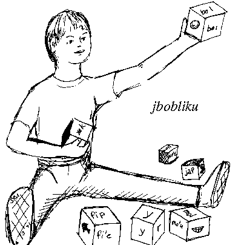

  
  
  
## 第4章 : ロジバンの形態論  

### 1.  はじめに  
  
形態論とは、語の形を扱うルール・文法のことである。  
英語は、複数形や時制で単語が変形するが、ロジバンは変形しないため、ロジバンの形態論はかなり単純である。  
たとえば、ものの数を表す時には、数を表す語を加える、時制についても同じ、等。 しかし「派生」はある。既存の語から新しい語を作る。  
語の形成が規則的なので、語の形を見ると、使い方、タイプ、由来が分かる。（例：ルジュボ）  
ロジバンの音は、ルールによって語に分解することができる。  
以下に示すのは、ロジバンの文字の慣例である。  
   
- 1) V: 母音 a e i o u “y” は除く  
- 2) VV: 二重母音 ai ei oi au もしくはアポストロフィで分けられた母音の連続 [a, e, i, o, u] ＋ ‘ + [a, e, i, o, u]  
- 3) C: 子音 b c d f g j k l m n p r s t v x z  
- 4) CC: 開頭二重子音 （bl br cf ck cl cm cn cp cr ct dj dr dz fl fr gl gr jb jd jg jm jv kl kr ml mr pl pr sf sk sl sm sn sp sr st tc tr ts vl vr xl xr zb zd zg zm zv）  
- 5) C/C: 許可二重子音 （第３章） 同じ子音 有声・無声どうし（r, l, m, nを除く）、ある禁止ペア以外  
- 6) C/CC: 最初の２つが許可二重子音、次の２つが開頭二重子音  
  
ロジバンには３つの基本的な語クラス（品詞）がある。英語は８個品詞があると言われる。これらは文字の並びから識別できるようになっている。  
  
- シマヴォ (cmavo): 機能語 and, if, the, to  
- ブリヴラ (brivla): 内容語 come, red, doctor, freely  
- シメネ (cmene): 固有名 James, Afghanistan, Pope John Paul II  
  
### 2.  シマヴォ (cmavo)

シマヴォは、機能語 （英語の冠詞, 接続詞, 前置詞, 数, 句読点, etc. に相当）である。  
100個以上のサブカテゴリ(セルマホ)がある。これらは 5～19章で扱い、20章でまとめる。  
Standard cmavo occur in four forms defined by their word structure.  
Here are some examples of the various forms: 語の構造によって、４つの形式がある：  
  
```
V形    .a .e .i .o .u
CV形   ba ce di fo gu
VV形   .au .ei .ia .o'u .u'e
CVV形  ki'a pei mi'o coi cu'u  
```  
  
VVV+, CVVV+ の形、および、 `x` で始まるものは、実験用に予約してある。（例： ku’a'e sau’e bai’hai “x”+VV）  
実験用とは、正式な仕様、辞書には入っておらず、話者により使用される、文法拡張用の”非常口”である。  
VVは、１節の二重母音にプラスして、以下の１０個の二重母音が可能：  
  
```
.ia .ie .ii .io .iu
.ua .ue .ui .uo .uu 
```
  
Cyの形は、ロジバンのアルファベットを表す。（17章）  
複合シマヴォは、２つ以上シマヴォを連結したものであり、分割した時と意味は同じ。  
二重子音がなく、母音で終わるという特徴から、簡単に特定できる。(例:2.1, 2.2, 2.3)  
```
2.1)  .iseci’i
      .i se ci’i
2.2)  punaijecanai
      pu nai je ca nai
2.3)  ki’e.u’e
      ki’e .u’e 
```
  
母音で始まる語は、全てポーズ `.` が語頭に必要。  
  

```
2.4)  ki'e'u'e
```
は、実験用の４母音シマヴォである。  
  

```
2.5)  cy.ibu.abu
      cy. .ibu .abu
```
では、前後の語のポーズがくっついている。シマヴォ, 複合シマヴォには強調が不要。  
２音節シマヴォでは、普通最初の母音につける。  
```
2.6)  .e'o ko ko kurji
      .E'o ko ko KURji
```
ある語の最後と、次の語の最初の音節を強調する場合、その間に声門閉鎖を入れる。  
  

```
2.7)  le re nanmu （”２人の男”）
```
の場合、  
```
2.8)   LE re NANmu → OK
2.9)   le RE. NANmu → ポーズを挿入すればOK
2.10)  le re NANmu → OK （最も一般的）
```

### 3.  ブリヴラ (brivla)
  
ブリヴラはロジバンの核となる命題語であり、名詞, 動詞, 形容詞, 副詞などをすべて包含したものである。  
ギスム（語根）、ルジヴォ(複合語)、フヒヴラ(借用語)の3つのサブタイプがあり、これらは形態論によって定義できる。  
新しい概念をブリヴラとして「その場」で作れ、ロジバンの語彙を拡張できる。   
全てのブリヴラの特長 1) 母音で終わる 2) 最初の５文字（`y` と `'` は除く）に二重子音を含む 3) 最後から２番目の音節にアクセントがある。  
二重子音があることから、シマヴォからは区別され、最後が母音で終わることから、シメーネとも区別される。  
  
### 4.  ギスム(gismu)
  
ロジバンの根語であり言語に基本的な概念を表す。  
基本的な概念、他の言語で頻出する概念、複合語を構成するのに便利な概念、ロジバンの概念、等が含まれる。  
ギスムは、意味空間の分割を表すわけではない。歴史的経緯、冗長なものもある。 全部で 1350のギスムがある。  
これらのほとんどと、接続形（ラフシ）と、200の主なシマヴォを覚えれば言語でうまくコミュニケーションができる（他の自然言語よりも少ない！）。  
ギスムの形式には強い制限がある。 `broda` などの例を除いて、最後の母音だけが異なるようなギスム対は無い。  
また、お互いに音がなるべく似ないように設計されている（例： `kismu`, `xismu`, `gisnu`, `gizmu`などは無い)。  
ギスムは、中英ヒンディー西露アラビア各言語の語の部分から構成されている。  
各語をロジバンの音韻で書きそれを各言語の話者数で重み付けサンプリングする。このアルゴリズムは14節に説明されている。   
```
例：  
4.1)  creka シャツ  
4.2)  lijda 宗教  
4.3)  blanu 青  
4.4)  mamta 母  
4.5)  cukta 本  
4.6)  patfu 父  
4.7)  nanmu 男性  
4.8)  ninmu 女性
```
  
### 5.  ルジヴォ (lujvo)
  
ブリヴラ で ブリヴラ を修飾してできた語。意味が広すぎるときに意味を限定する。最初のものが次のものを修飾する。形容詞や副詞のような役割を果たす。  
```
5.1)  skami pilno
     コンピューターのユーザー 
```
  
さらに３つ以上をつなげて複雑な概念を表すこともできる。  
タンルの構文は曖昧ではないが、意味は曖昧である可能性がある。  
例：`skami pilno`は「コンピューターのユーザー」か「コンピューターであるユーザー」か分からない。  
タンルを作るのは、科学というよりは詩・創造的に近い。作り方は５章で説明する。  
```
5.2)  barda bloti
     大きなボート（＝船）
5.3)  patfu mamta
     父方の祖母
5.4)  mamta patfu
     母方の祖父　（「母の性質を持った父」にも解釈され得る）
```
あるタンルの概念が有用であり、頻繁に表現される場合は、意味を一つ選び新しいブリヴラとして定義した方がいい。これらはルジヴォと呼ばれる。  
```
5.5)  sampli
     コンピューターのユーザー
5.6)  bralo'i (← barda bloti) 
     船
```
ルジヴォは、ギスムの「概念」を表す単位「ラフシ」から構成される。１つが１つのギスムに相当する。  
シマヴォやギスムと勘違いされないように、“ハイフン文字”が必要なこともある。  
```
5.7)  mampa'u （← mamta (man-) ＋ patfu (-pa'u) ）
     母方の祖父 
```
ルジヴォは意味を１つだけ持つが、複数の形を持つ場合がある。それらに意味の違いはない。  
ギスムに対するラフシは複数あるため、単一の意味を表すlujvo は複数あり得る。  
例えば、bridi valsi は、 brivla brivalsi bridyvla bridyvalsi のいずれにもなり得る。  
二重母音が最初の５字に入っている、母音で終わる、という規則を満たす必要がある。   
二重子音が許可されてない、もしくは、単語を分割してしまう誤解がある場合、`y` を挿入する。  
二重子音が出現しない場合には、`r` を挿入する。
```
5.8) soirsai
     sonci (soi-) sanmi (-sai)
     兵士の　食事
     軍用食糧 
```
(この場合、`r`が無いと soi sai という２つのシマヴォに分割されてしまう)   
ルジヴォの重要な点は、書いている・話している時に作ることができることであり、ルールに沿っていれば、おそらく通じるだろう。
  
### 6.  ラフシ (rafsi)  

ギスムには2個から5個のラフシがあるが、各ラフシは必ず1個のギスムに対応する。  
ルジヴォの作り方に沿っていればどれを使ってもいい。  
どれを辞書標準形にするか、という並び替えアルゴリズムがある (12節を参照)。ギスムには必ず２つ以上の rafsi がある。  
これは、-CVC/CV or -CCVCV(gismu そのもの、5文字 rafsi) と、-CVC/C- or -CCVC- (4文字 rafsi) である。  
（ハイフンはどの位置で他の rafsi とくっつくかを表したもの）４・５文字 rafsi から作られた lujvo は、「長い lujvo」  
もしくは「非縮退 lujvo」と呼ばれる。
  
```
6.1)  mamtypatfu ← mamta patfu
     母 の 父 → 母方の祖父
6.2)  lerfyliste ← lerfu liste
     文字リスト → アルファベット文字
6.3)  nancyprali ← nanca prali
     年 の 利益 → 年収
6.4)  prunyplipe ← pruni plipe
     弾力性 のある ジャンプ → ばね
6.5)  vancysanmi ← vanci sanmi
     夜 の 食事 → 夕食 
```
  
短いラフシ -CVC- -CCV- -CVV- を最高３つ持つ可能性がある。  
gismu が持つrafsi の数は、「lujvo を作る上でどのぐらい役に立つ可能性があるか」による。  
zmadu (～以上）は、英語の “-er” を作る上で役に立つので、 -zma- -mau- の２つのラフシがある （例： labmau “より白い”)。  
  
-CVC形, -CCV形, -CVV形は、ギスムに対して最大１個ずつしかない。  
-CCV- と-CVV- の両方を持つものはまれであり、-CVC- も含めた３つを持つものはもっとまれである。  
-CVC- と、CCV, CVVのどちらか、を持つものは多い。  
  
３文字しかないので、「短い rafsi 空間」を有効に使う必要がある。しかも認識しやすいように文字はすべて元となるギスムから取る。  
CVC/CV 型のギスムである sakli に対して、-sak-, -sal-, -sa'i- ... などがあるが、実際の短いラフシは -sal- だけである。  
CCV/CV 型のギスムである blaci に対して、-bac-, -lac-, -ba'i- などがあるが、これらは他のギスムに割り当てられており、  
実際のラフシはこの中には無い（ラフシは自由に割り当てることはできない）。  
  
-CVV- は、二重母音を含まなければならず、CCV は、開頭二重子音を含まなければならない。 ラフシが割り当てられているシマヴォもある。  
例えば、10個の数字には CVC 形のラフシが割り当てられている。短いラフシのみで構成されたルジヴォは完全縮退ルジヴォと呼ばれる。  
  
```
6.6)  cumfri
      “cumki lifri”(可能な 経験)から
      “可能な 経験”
6.7)  klezba
      “klesi zbasu”(種類 メーカー)から
      “メーカーの種類”
6.8)  kixta'a
      “krixa tavla”(叫ぶ 話)から
      “大声の会話”
6.9)  sniju'o
      “sinxa djuno”(標識 知っている)から
      “知っているというサイン？”
6.10)  mampa'u
       “mamta patfu” から
       “母方の祖父”
6.11)  lerste
       “lerfu liste”(文字 リスト)から
       “文字リスト”＝アルファベット
```
CVC形は、ルジヴォの最後には使えない。  
ルジヴォは必ず６文字以上になる。 ハイフン文字が必要になることがある。これは、`y`,`r`,`n` のいずれかである。  
CVC形をつなぐときに許可されていない二重子音ができたり、２つの単語に分割されてしまう場合は、場合は、`y`を挿入する。  
例："pante tavla" → patyta'a, "mudri siclu" → "mudysiclu"。  
  
`y`ハイフンは、4文字ラフシを連結する時にも使う。  
例：zunle jamfu → zunlyjamfu CVV-CVV 形の場合は、子音ペアが無くなるので `r`/`n` ハイフンが必要である。  
  
CVV-CVC/CV or CVV-CCVCVの時にも、分割を防ぐために必要である。  
３つ以上のラフシからなるルジヴォでは、必ずハイフンが必要である。 `r`ハイフンの次の文字が`r`である場合は、`n`ハイフンを使う。  
`zei` をはさんでルジヴォを作る方法もある。ラフシをもたないシマヴォや、シメネ、フヒヴラは、この方法を使う。  
```
6.12)  bridi zei valsi ( = brivla)
6.13)  xy. zei kantu
       X ray
6.14)  kulnr,farsi zei lolgai
       Farsi floor-cover
       Persian rug
6.15)  na'e zei .a zei na'e zei by. livgyterbilma
       non-A, non-B liver-disease
       non-A, non-B hepatitis
6.16)  .cerman. zei xarnykarce
       Sherman war-car
       Sherman tank
```
例 6.15 から zei を抜いた文は、ブリヴラで終わってはいなく、文法的ではない？？  
```
6.17)  na'e zei .a zei na'e zei by. zei livgyterbilma
       non-A-non-B-hepatitis
```
こうすることにより、全体が１つのルジヴォとなり、`bilma` の場所構造を取る。 `zei` フレーズの中でラフシは使えない（単語ではないから）。  
  

