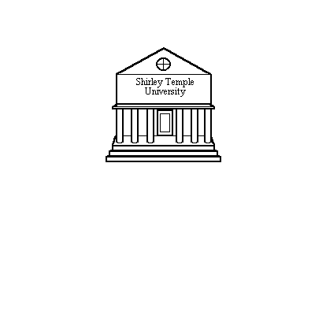

  
  
  
## 第5章 : "可愛い小さい女子の学校" ロジバンのセルブリ構造 
  
### 5.1 ロジバンの内容語 : ブリヴラ  
  
ブリディの中心には、論理的かつ物理的にも、セルブリを構成する1つ以上の単語が存在する。  
ブリディは物事の関係を表し、セルブリは関係が何を参照しているかを表す。  
  
**例 5.1**  
do mamta mi  
あなたは私の母だ。  
  
**例 5.2**  
do patfu mi  
あなたは私の母だ。  
  
例 5.1 と 例 5.2 の違いはセルブリにある。  
  
最も簡単なセルブリは、ロジバンの内容語である1語のブリヴラである。  
ブリヴラには異なる3種類がある。ロジバンに組み込まれているもの（ギスム **_gismu_**）、  
ギスムの組み合わせから派生したもの（ルジヴォ **_lujvo_**）、他の言語から（通常は修正された形で）引用されたもの（フヒヴラ **_fu'ivla_**）である。  

